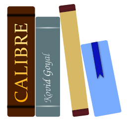

This is a library of books that I enjoy and recommend and software I use and support.

<h2>Books</h2>

  

    
    <h3>The Phoenix Project</h3>
  

  

    
    <h3>Never Enough</h3>
  

  

    
    <h3>Never Split the Difference</h3>
  

  

    
    <h3>Redemption Ark</h3>
  

  

    
    <h3>The Player of Games</h3>
  

<h2>Software</h2>

  

    
    <h3>Lotion</h3>
  

  

    
    <h3>Postman</h3>
  

  

    
    <h3>VS Code</h3>
  

  

    
    <h3>Trello</h3>
  

    

    
    <h3>Calibre</h3>
  

